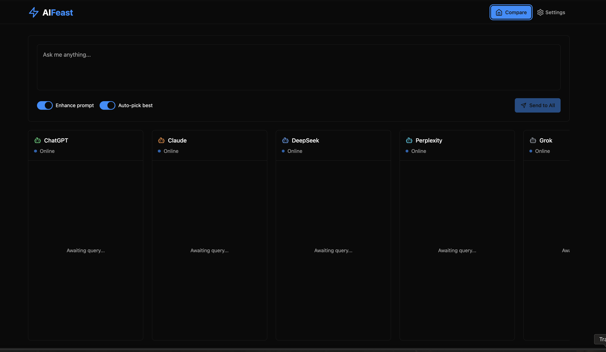

# AIFeast 🤖


**AIFeast** is a stupid AF AI comparison tool that allows you to query multiple AI providers simultaneously and compare their responses side-by-side. Get the best insights by leveraging different AI models and their unique strengths in a single, elegant interface.

## ✨ Features

### 🔄 Multi-Provider Support
- **OpenAI (ChatGPT)** - Industry-leading conversational AI
- **Anthropic (Claude)** - Advanced reasoning and analysis
- **DeepSeek** - Efficient open-source alternative
- **Perplexity** - Real-time web-connected AI
- **Grok** - X's AI assistant

### 🚀 Smart Querying
- **Prompt Enhancement** - Automatically improve your queries for better results
- **Parallel Processing** - Query all enabled providers simultaneously
- **Best Response Detection** - AI-powered selection of the most helpful response
- **Response Metrics** - Track response times and token usage

### 🎨 Modern Interface
- **Dark Theme** - Easy on the eyes with a sleek design
- **Responsive Layout** - Works perfectly on desktop and mobile
- **Side-by-side Comparison** - Compare responses in organized columns
- **Real-time Updates** - See responses as they arrive

### 🔒 Privacy & Security
- **Local Storage** - All settings and API keys stored locally
- **Encrypted Data** - API keys are encrypted before storage
- **No Data Collection** - Your queries and responses stay private

## 🛠️ Tech Stack

- **React 18** with TypeScript
- **Vite** for fast development and building
- **Tailwind CSS** for styling
- **Radix UI** for accessible components
- **OpenAI SDK** for unified API access
- **Crypto-JS** for encryption

## 📦 Installation

1. **Clone the repository**
   ```bash
   git clone <repository-url>
   cd aifeast
   ```

2. **Install dependencies**
   ```bash
   npm install
   ```

3. **Start the development server**
   ```bash
   npm run dev
   ```

4. **Open your browser**
   Navigate to `http://localhost:5173`

## ⚙️ Configuration

### Setting Up API Keys

1. Click the **Settings** button in the navigation
2. Enable the AI providers you want to use
3. Add your API keys for each provider:

#### OpenAI
- Get your API key from [OpenAI Platform](https://platform.openai.com/api-keys)
- Default model: `gpt-4.1`

#### Anthropic (via OpenRouter)
- Get your API key from [OpenRouter](https://openrouter.ai/)
- Uses Claude 3.5 Sonnet model

#### DeepSeek (via OpenRouter)
- Get your API key from [OpenRouter](https://openrouter.ai/)
- Uses the free DeepSeek R1 model

#### Perplexity
- Get your API key from [Perplexity](https://www.perplexity.ai/)
- Includes real-time web search capabilities

#### Grok
- Get your API key from [X AI](https://x.ai/)
- Uses the Grok Beta model

### Provider Settings

For each provider, you can configure:
- **Enable/Disable** - Toggle provider on or off
- **API Key** - Your authentication key
- **Model** - Specific model to use (optional)
- **Max Tokens** - Maximum response length

### App Settings

- **Enhance Prompts** - Automatically improve your queries for better results
- **Auto Pick Best** - Let AI determine the best response automatically
- **Show Metrics** - Display response times and token counts

## 🎯 Usage

1. **Enter your query** in the input field at the top
2. **Press Enter** or click the send button
3. **Watch responses** appear in real-time from each enabled provider
4. **Compare results** side-by-side in organized columns
5. **Best response** is automatically highlighted (if enabled)

### Tips for Better Results

- **Be specific** - Detailed queries get better responses
- **Use prompt enhancement** - Let the AI improve your query
- **Compare different strengths** - Each AI has unique capabilities
- **Check response times** - Some providers are faster than others

## 📊 Response Metrics

Each response shows:
- **Response Time** - How long the AI took to respond
- **Token Count** - Number of tokens used (when available)
- **Timestamp** - When the response was received
- **Error Handling** - Clear error messages if something goes wrong

## 🔧 Development

### Available Scripts

- `npm run dev` - Start development server
- `npm run build` - Build for production
- `npm run preview` - Preview production build
- `npm run lint` - Run ESLint

### Project Structure

```
src/
├── components/          # React components
│   ├── ui/             # Reusable UI components
│   ├── MainPage.tsx    # Main application interface
│   ├── Navigation.tsx  # Top navigation
│   ├── QueryInput.tsx  # Query input component
│   ├── Settings.tsx    # Settings page
│   └── ...
├── context/            # React context providers
├── types/              # TypeScript type definitions
├── utils/              # Utility functions
│   ├── aiService.ts    # AI provider integrations
│   └── encryption.ts   # Data encryption utilities
└── ...
```

## 🤝 Contributing

1. Fork the repository
2. Create a feature branch (`git checkout -b feature/amazing-feature`)
3. Commit your changes (`git commit -m 'Add amazing feature'`)
4. Push to the branch (`git push origin feature/amazing-feature`)
5. Open a Pull Request

## 📝 License

This project is open source and available under the [MIT License](LICENSE).

## 🆘 Support

If you encounter any issues or have questions:

1. Download it and solve it yourself. I can't be associated in encouraging this stupidity.


**Happy AI querying!** 🚀✨

